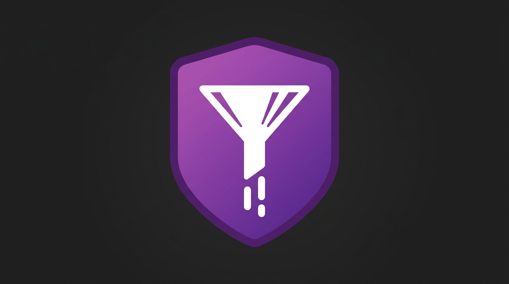

# TokenGuard: AI Code Dehydrator

**Cursor Context Window is too small? Save 50%+ API Costs with one click.**

<p align="center">
  
</p>

---

## The Problem

AI coding assistants like Cursor and Claude have limited context windows. Every token counts. But your code is bloated with comments, whitespace, and documentation that matters to humans — not to AI.

## The Solution

TokenGuard dehydrates your selected code in seconds:

- **Safe Dehydration** — Protects Python indentation, preserves JS/TS syntax structure
- **Comment Removal** — Strips JSDoc and single-line comments automatically
- **One-click Clipboard** — Select code → right-click → Done. Compressed code is in your clipboard.

## Usage

1. Select code in your editor
2. Right-click → **TokenGuard: Dehydrate for AI**
3. Paste into Cursor, Claude, or any AI assistant

Your code is now 40-60% smaller with zero semantic loss.

## Features

| Feature | Description |
|---------|-------------|
| JSDoc Removal | Removes all `/** ... */` block comments |
| Comment Strip | Removes all `//` single-line comments |
| Indentation Safe | Preserves leading whitespace (Python-safe) |
| Line Compression | Removes trailing whitespace, filters empty lines |
| Stats Preview | Shows exact token savings percentage |

## Keyboard Shortcut

Add to your `keybindings.json`:

```json
{
  "key": "ctrl+shift+d",
  "command": "token-guard.dehydrate"
}
```

## Requirements

- VS Code 1.85.0 or later

## Changelog

### 1.0.0

- Initial release
- One-click code dehydration
- Python/JS/TS safe whitespace handling
- Clipboard integration

---

**Made for developers who count tokens.**
